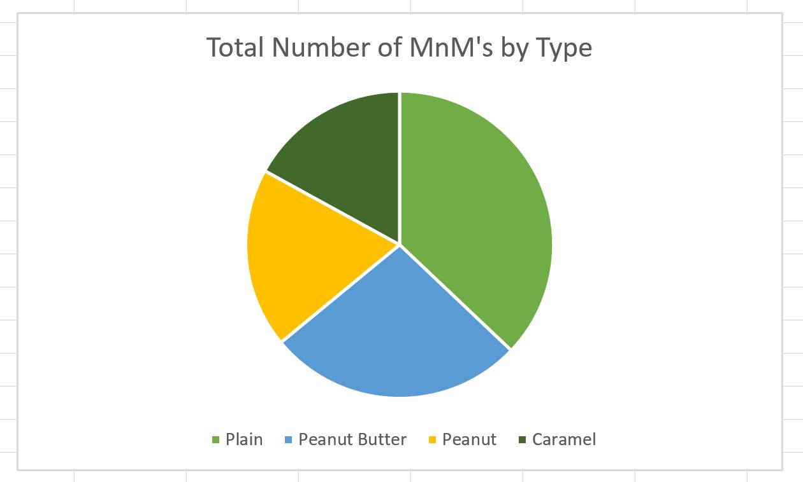

# Exercise 1a

Analysis of Flight Data: I noticed that on all but 4 of the 30 days, less flights were tracked than were scheduled, which could possibly be due to the recent issue with flight cancellation on Southwest Airlines.

Visualizing Candy Data: I noticed that the peanut and caramel MnM packs always had less than 10 MnM’s per package, which is likely due to those candies being larger in size. The plain and peanut butter MnM packs almost always had more than 10 MnM’s per package. 

